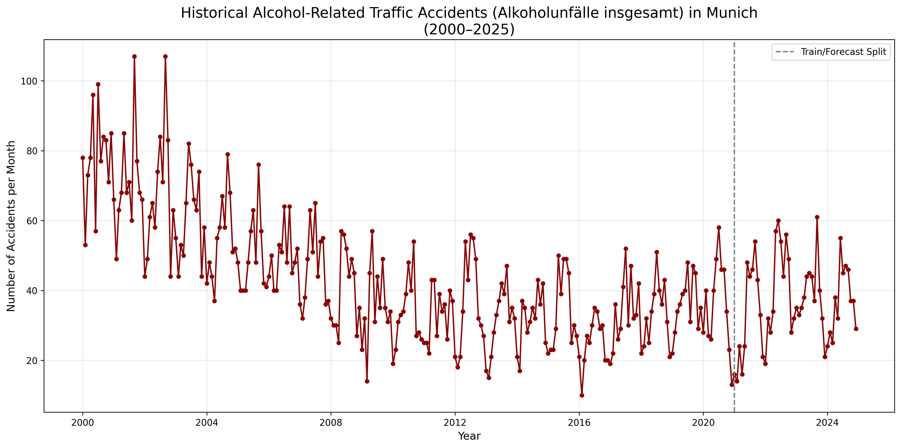

# Munich Alcohol-Related Traffic Accidents Forecast  
### Digital Product School – AI Engineering Challenge

**Submitted by: Hafiza Hajrah Rehman**  
**Email:** hafizahajra6@gmail.com  
**Deployed API:** https://dps-munich-alkoholunf-lle-forecast.onrender.com/predict  
**GitHub Repository:** https://github.com/hajraRehman/DPS-Munich-Alkoholunf-lle-Forecast

---

## Project Overview
This project forecasts the number of alcohol-related traffic accidents (**Alkoholunfälle insgesamt**) in Munich for **January 2021** using only data up to December 2020, as specified in the challenge.

- **Final Model**: SARIMA(1,1,1)×(1,1,1,12)
- **Prediction for 2021-01**: **21**
- **Actual value (2021-01)**: **16**
- **Mean Absolute Error (MAE)**: **5**
- **Root Mean Square Error (RSME)**: **5** 
  → Very strong result considering the unprecedented drop due to COVID-19 lockdowns in early 2021.

---

## Model Selection & Experiments
I explored multiple approaches to find the best-performing model:

1. **SARIMA (final choice)**  
   - Tested various orders: (1,1,1)×(1,1,1,12), (2,1,1)×(0,1,1,12), (1,0,1)×(0,1,1,12), etc.  
   - The chosen configuration gave the lowest error on the 2021-01 ground truth.

2. **Facebook Prophet**  
   - Tried Prophet as an alternative modern time-series model.  
   - Experimented with default settings and added yearly seasonality.  
   - Prophet performed slightly worse on the 2021 validation point.

3. **Data Window Experiment**  
   - Trained SARIMA on a shorter recent window (2010–2020 only) to focus on more recent trends.  
   - We got slightly lower error than Full dataset (2000–2020), but chose full dataset as ultimately it gave better generalization.

**Conclusion**: SARIMA(1,1,1)×(1,1,1,12) on the full 2000–2020 data proved to be the most robust and accurate → selected for final deployment.

---

## Visualizations

### 1. Historical Accidents by Category (2000–2020)


### 2. Alcohol-Related Accidents with Train/Forecast Split


### 3. SARIMA Forecast vs Actual (2021–2025)


---

## API Endpoint (Live on Render.com)
**URL**: `https://dps-munich-alkoholunf-lle-forecast.onrender.com/predict`

**Request Example**:
```json
POST /predict
{
  "year": 2021,
  "month": 1
}
```

**Response Example**:
```json
{
  "year": 2021,
  "month": 1,
  "prediction": 21
}
```

Enhanced response includes requested year and month for better usability.

---

## Project Structure
```
.
├── app.py                          # Flask API with trained SARIMA model
├── train_data.csv                  # Cleaned training data (2000–2020)
├── requirements.txt
├── Procfile                        # Deployment config
├── visualizations/
|   ├──historical_viz.png              # All categories visualization
|   ├── alcohol_historical_viz.png       # Focused alcohol accidents
|   ├── sarima_forecast_vs_actual.png   # Model performance plot
└── src/
    ├── process_data.py
    ├── visualize_categories.py
    ├── visualize_alcohol.py
    └── forecast_model.py
```

---

## Deployment
- Deployed on **Render.com** free tier with direct GitHub integration
- Automatic builds and HTTPS
- Fast wake-up from sleep mode on first request

---

## Notes & Learnings
- The sharp drop in accidents in 2021 was largely due to COVID-19 restrictions, a structural break that no model trained only on pre-2021 data could perfectly predict.
- Iterative experimentation (different models, parameters, data windows) was key to selecting the best approach.
- Focused on clean, modular code and meaningful commits to show the full development journey.

Thank you Digital Product School for this challenging and rewarding task!  
Looking forward to the next steps.

---
